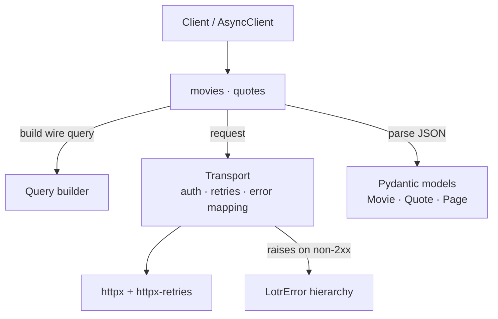

# lotr-sdk

[](https://github.com/Site404NotFound/James-Hippler-SDK/actions/workflows/ci.yml)
[](https://codecov.io/gh/Site404NotFound/James-Hippler-SDK)
[](https://www.python.org/)
[](LICENSE)
[](https://github.com/astral-sh/ruff)
[](https://mypy-lang.org/)

A clean, fully typed Python SDK for [The One API](https://the-one-api.dev), the Lord of the Rings
API. It covers the **movie** and **quote** endpoints with a fluent query builder, automatic
pagination, typed models, structured errors, and both synchronous and asynchronous clients.

> Built as a take-home exercise. Please do not publish or share this SDK publicly.

## Features

- **Sync and async** clients over one shared core (`Client` / `AsyncClient`).
- **Fluent query builder** for filtering, sorting, and pagination, with typo-safe field enums.
- **Typed Pydantic v2 models** with snake_case attributes and forward-compatible parsing.
- **Automatic pagination** via lazy `iter_all()`.
- **Structured errors** — one `LotrError` base with per-status subclasses.
- **Resilient transport** — retries `429`/`502`/`503`/`504` and network errors with jittered backoff (via [`httpx-retries`](https://pypi.org/project/httpx-retries/)), honoring `Retry-After`.
- Ships `py.typed`; clean under `mypy --strict`; 100% unit-test coverage.

## Architecture



Each layer depends only on the ones below it. See [design.md](design.md) for the rationale.

## Requirements

- Python **3.11+**
- A free API key: <https://the-one-api.dev/sign-up>

## Installation

The package isn't published, so install from source with [Poetry](https://python-poetry.org/):

```bash
git clone <this-repo>
cd James-Hippler-SDK
poetry install
```

Run code with `poetry run python ...`, or `poetry shell` to activate the environment.

## Authentication

The client reads `THE_ONE_API_KEY` from the environment, or takes the key directly:

```python
from lotr_sdk import Client

client = Client()                     # uses THE_ONE_API_KEY
client = Client(api_key="your-key")   # or pass it directly
```

## Quickstart

```python
from lotr_sdk import Client, Query

with Client() as client:
    for movie in client.movies.list():
        print(movie.name, movie.budget_in_millions)

    # Filter, then fetch one by id and its quotes
    blockbusters = client.movies.list(Query().where("budgetInMillions").gt(100))
    movie = client.movies.get(blockbusters[0].id)
    quotes = client.movies.quotes(movie.id, Query().limit(10))

    # Quotes directly
    quote = client.quotes.get(client.quotes.list(Query().limit(1))[0].id)
```

### Async

The async client mirrors the sync one — `await` calls and use `async with` / `async for`:

```python
import asyncio
from lotr_sdk import AsyncClient, Query

async def main():
    async with AsyncClient() as client:
        # Fetch independent resources concurrently
        movies, quotes = await asyncio.gather(
            client.movies.list(Query().where("budgetInMillions").gt(100)),
            client.quotes.list(Query().limit(5)),
        )
        async for quote in client.quotes.iter_all():
            ...

asyncio.run(main())
```

## Filtering, sorting, and pagination

`Query` is chainable: start a filter with `.where(field)`, finish it with an operator, and combine
with `.sort()`, `.limit()`, `.page()`, and `.offset()`. `field` is a string or a typo-safe
`MovieField` / `QuoteField` enum member.

```python
from lotr_sdk import MovieField, Query

Query().where(MovieField.BUDGET_IN_MILLIONS).gt(100).where("name").matches("/ring/i").limit(10)
```

| Builder call | API form |
|---|---|
| `.where("name").eq("Gandalf")` | `name=Gandalf` |
| `.where("name").ne("Gandalf")` | `name!=Gandalf` |
| `.where("name").in_(["A", "B"])` | `name=A,B` |
| `.where("name").not_in(["A", "B"])` | `name!=A,B` |
| `.where("name").exists()` / `.not_exists()` | `name` / `!name` |
| `.where("name").matches("/ring/i")` | `name=/ring/i` |
| `.where("budgetInMillions").gt(100)` / `.gte(100)` | `budgetInMillions>100` / `>=100` |
| `.where("runtimeInMinutes").lt(200)` / `.lte(200)` | `runtimeInMinutes<200` / `<=200` |
| `.sort("name", descending=True)` | `sort=name:desc` |
| `.limit(10).page(2).offset(5)` | `limit=10&page=2&offset=5` |

Full reference — field enums and on-the-wire encoding — is in [querying.md](querying.md).

`iter_all()` lazily walks every page, so you can stream results without managing page numbers:

```python
for movie in client.movies.iter_all(Query().limit(100)):
    ...  # fetches the next page only when needed
```

## Error handling

All errors derive from `LotrError`, so you can catch everything with one `except`, or handle
specific cases:

```python
from lotr_sdk.exceptions import LotrError, NotFoundError, RateLimitError

try:
    movie = client.movies.get("does-not-exist")
except NotFoundError:
    ...
except RateLimitError as exc:
    retry_in = exc.retry_after
except LotrError:
    ...
```

| Exception | Raised when |
|---|---|
| `ConfigurationError` | No API key, or invalid options |
| `AuthenticationError` | `401` — missing/invalid key |
| `ForbiddenError` | `403` |
| `NotFoundError` | `404`, or a get-by-id with no match |
| `RateLimitError` | `429` (carries `retry_after`) |
| `ServerError` | `5xx` |
| `APIError` | base for the HTTP errors above (`status_code`, `message`) |
| `TransportError` | network failure / timeout |

## Logging

The SDK emits structured logs on the `lotr_sdk` logger (each request at `DEBUG`, give-ups at
`ERROR`) and attaches a `NullHandler`, so it stays silent until you opt in:

```python
import logging
logging.basicConfig(level=logging.DEBUG)
```

## Configuration

```python
Client(
    api_key=None,        # falls back to THE_ONE_API_KEY
    base_url=None,       # default: https://the-one-api.dev/v2
    timeout=None,        # default: 30.0 seconds
    max_retries=None,    # default: 3 (429/502/503/504/network)
    backoff_factor=None, # default: 0.5 (jittered exponential)
)
```

## Documentation

- [querying.md](querying.md) — full filter/sort/pagination reference, field enums, and wire encoding.
- [endpoints.md](endpoints.md) — each endpoint with real captured request/response examples.
- [design.md](design.md) — architecture and design rationale.
- [examples/sample_output.md](examples/sample_output.md) — output of the runnable demos.

## Development

```bash
# Unit tests (mocked; no network or key)
poetry run pytest -m "not integration"

# Integration tests against the live API (needs a key)
export THE_ONE_API_KEY="your-key"
poetry run pytest -m integration

# Lint, format, and type checks
poetry run ruff check . && poetry run ruff format --check . && poetry run mypy src

# Runnable demos (need a key)
poetry run python examples/demo_sync.py
poetry run python examples/demo_async.py
```

## Known upstream limitation

The live API returns **HTTP 500 when sorting `/movie` or `/quote`** (sorting works on other
collections such as `/book` and `/character`). The SDK's `sort()` follows the API spec and is
verified on endpoints that support it; it surfaces the upstream failure as a `ServerError` and will
work unchanged once the upstream is fixed.

## License

MIT — see [LICENSE](LICENSE).
