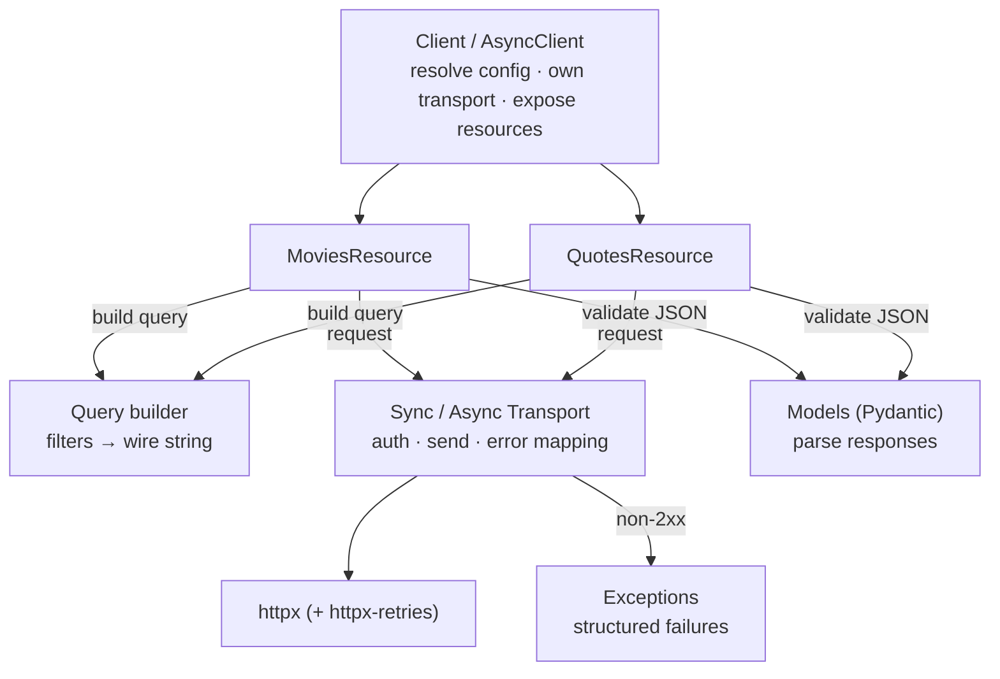
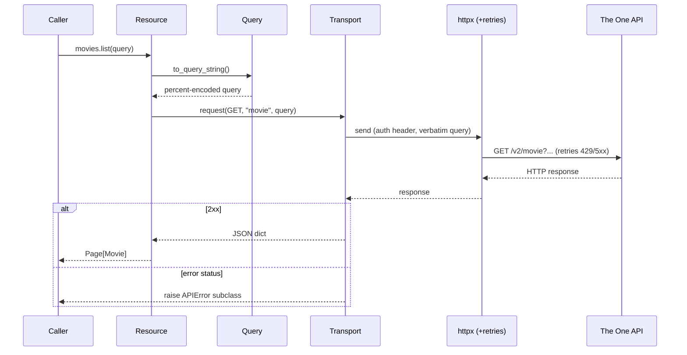

# Design

This document explains how the SDK is structured and why. The goal was a small, production-minded
client that is pleasant to use, safe to extend, and faithful to the real API's behavior.

## Goals and scope

The assessment asks for an SDK covering the **movie** and **quote** endpoints (`/movie`,
`/movie/{id}`, `/movie/{id}/quote`, `/quote`, `/quote/{id}`), written "as if implementing all
endpoints." The design therefore optimizes for:

- **Clarity** — small modules with single responsibilities and full type hints.
- **Extensibility** — adding a resource (`/character`, `/book`) or a new filter operator is a
  localized change.
- **Correctness** — behavior verified against the live API, not just assumed from docs.
- **Testability** — pure logic separated from I/O; both are covered.

## Architecture

The SDK is layered; each layer depends only on the ones below it.

A single `list()` call threads through those layers like this:

The package separates the **execution-agnostic core** (shared by both clients) from the
**sync/async surface**. The transport, client, and pagination layers keep their two forms in sibling
`sync.py` / `aio.py` modules (`aio` names the async variant, avoiding the reserved `async` keyword);
resources instead co-locate each endpoint's sync and async twins in one module (`movies.py`,
`quotes.py`), so the pair that must stay in lockstep is edited together. Internal packages use plain
(non-underscore) names; the public surface is each `__init__`'s `__all__`.

| Module | Responsibility |
|---|---|
| `config.py` | `ClientConfig`: immutable, validated settings; resolves the key from env. |
| `exceptions.py` | `LotrError` base + `APIError` subclasses + status→exception mapping. |
| `query/` | The fluent `Query` builder and its wire serialization. |
| `models/` | `movie.py`, `quote.py`, the generic `page.py` envelope, and a shared `base.py`. |
| `fields/` | `MovieField` / `QuoteField`: enums of the known queryable fields per resource. |
| `transport/` | `base.py` (shared logic) + `sync.py` / `aio.py` transports (the only I/O). |
| `pagination/` | `sync.py` / `aio.py` lazy iterators that walk every page. |
| `resources/` | `base.py` helpers + `movies.py` / `quotes.py`, each holding the endpoint's sync and async resource. |
| `client/` | `sync.py` `Client` / `aio.py` `AsyncClient` facades + a shared `base.py`. |

Each package's `__init__` re-exports its public names, so the import surface (`from lotr_sdk import
Client, AsyncClient, ...`) is independent of this internal layout.

## Key design decisions

### Sync and async over one shared core
Both clients are thin facades over a shared `BaseTransport`. `BaseTransport` holds everything that
doesn't depend on the execution model — request construction, auth, response handling, and error
mapping. The sync and async subclasses differ only in how a request is *sent* (`httpx.Client` vs
`httpx.AsyncClient`). Each wraps its client in an `httpx-retries` `RetryTransport`, so retries and
backoff happen inside the transport stack rather than in a hand-rolled loop — there is no `sleep`
call anywhere in the SDK. This keeps the non-trivial logic (error mapping) defined exactly once while
still giving callers real `async` I/O. Forcing every consumer into an event loop (async-only) was
rejected as poor ergonomics for scripts and notebooks; running async-under-the-hood for a "sync"
client was rejected as the wrong performance trade-off.

### Pydantic v2 models with aliasing and forward compatibility
`Movie`/`Quote` map the API's `_id` and camelCase keys to idiomatic snake_case attributes via field
aliases, and set `extra="ignore"` so that additive API changes never break deserialization. Models
are frozen (value-object semantics). `Page[T]` is a generic envelope that doubles as a read-only
sequence (`len`, indexing, iteration) plus `has_next_page`, so the common case reads naturally while
the pagination metadata stays available.

### Fluent query builder (Builder pattern)
Filtering is the headline feature, so it gets a discoverable, type-safe API:
`Query().where("budgetInMillions").gt(100).sort("name").limit(10)`. `.where(field)` returns a small
`FieldFilter` proxy whose operator methods (`eq`, `ne`, `in_`, `not_in`, `exists`, `not_exists`,
`matches`, `gt`, `gte`, `lt`, `lte`) append a filter and return the `Query` for chaining. Adding a
new operator is a one-method change in `FieldFilter`. `Query.copy()` enables side-effect-free
pagination.

### Query serialization — matched to real behavior
The most subtle part. The One API **URL-decodes the query string before parsing operators**, which
I verified empirically against the live endpoints. Consequences, all pinned by unit tests:

- Operator characters are percent-encoded (so they survive transport) while the `=` key/value
  separator and `&` joins stay literal.
- `>` and `<` are *valueless tokens* (`budgetInMillions>100`), whereas `>=`, `<=`, `=`, and `!=`
  carry a literal `=` (`runtimeInMinutes>=200`). The serializer models each filter as a
  `(key, value | None)` pair to capture exactly this distinction.

The builder emits this string; the transport hands it to httpx **verbatim** (via
`httpx.URL.copy_with(query=...)`) so httpx doesn't re-encode and corrupt the operators.

### Structured error handling
Every failure is a `LotrError`, so callers can catch broadly or narrowly. HTTP failures map to
`APIError` subclasses by status (`AuthenticationError`, `ForbiddenError`, `NotFoundError`,
`RateLimitError` with `retry_after`, `ServerError`); network/timeout failures become
`TransportError`; configuration problems become `ConfigurationError`. The mapping lives in one
function (`api_error_from_status`) and is unit-tested independently of the network.

A real-world wrinkle: a get-by-id for a missing resource returns **HTTP 200 with an empty `docs`
list**, not a 404. The resource layer detects this and raises `NotFoundError`, so absence is a typed
error rather than an `IndexError`.

### Resilient transport
Retries are delegated to [`httpx-retries`](https://pypi.org/project/httpx-retries/), wired in as a
`RetryTransport` on each client, rather than hand-rolled. It retries `429`/`502`/`503`/`504` and
network errors (timeouts, connection failures) with jittered exponential backoff, honoring the
`Retry-After` header. `500`/`501` are deliberately not retried — they are rarely transient. Defaults
(30s timeout, 3 retries, 0.5 backoff) are configurable per client; the SDK only forwards
`max_retries` and `backoff_factor`, taking the library's other defaults.

### Pagination
`iter_all()` returns a lazy iterator (sync) or async iterator that fetches each page only as it's
consumed and stops when `has_next_page` is false. The page-walking logic is written once and
parameterized by a `fetch(page_number)` callable, so it serves any resource.

### Logging
The transport emits structured logs on the `lotr_sdk` logger — a `DEBUG` record for a successful
request, a `WARNING` for an error response (`4xx`/`5xx`), and an `ERROR` when a request gives up
after retries (a network failure). The package installs a `NullHandler`, so it stays silent until
the application configures logging.

## Extensibility

- **A new endpoint** (e.g. `/character`): add a `Character` model, a `CharacterResource`
  (+ async variant) following the existing `_PATH` + parse-helper pattern, and expose it on the
  clients. No transport, query, or error changes needed.
- **A new filter operator**: add one method to `FieldFilter`.
- **API shape drift**: new response fields are ignored automatically; new error semantics are a
  change in one mapping function.

## Testing strategy

- **Unit tests** (default, no network): pure logic (config, exceptions, models, query
  serialization) is tested directly; the transport, resources, clients, and pagination are tested
  with `respx`-mocked HTTP across **both sync and async** paths — auth headers, verbatim query
  passthrough, status→exception mapping, retries and exhaustion, network failures, and not-found.
  100% line/branch coverage.
- **Integration tests** (`-m integration`, opt-in, gated on `THE_ONE_API_KEY`): exercise all five
  real endpoints, confirm filtering/regex/pagination, the not-found path, and that movie sort
  surfaces the upstream `ServerError`.
- **Quality gates**: `ruff` (lint + format), `mypy --strict`, run in CI across Python 3.11–3.14.

## Trade-offs and future work

- **Sync/async duplication**: construction is shared — resources inherit a generic `BaseResource`
  and both clients inherit a `BaseClient` that owns the constructor signature and config resolution.
  The resource *method bodies* remain duplicated across sync and async (a few one-liners each):
  because a sync method returns `T` while its async twin returns `Coroutine[..., T]`, a single typed
  abstract method cannot cover both under `mypy --strict`, and the bodies differ only by
  `async`/`await`. The twins live side by side in one module, and that parity is guaranteed by a
  runtime test (`tests/unit/test_parity.py`).
  Eliminating the bodies entirely would require code generation (an `unasync`-style build step),
  which is not worth it at this size; it would be worth revisiting if the surface grew much larger.
- **Upstream sort on `/movie` and `/quote`** currently 500s server-side (see the README). The SDK's
  `sort()` is correct and verified on endpoints that support it; no SDK change is needed when the
  upstream is fixed.
- **Next steps**: response caching/conditional requests, optional rate-limit pacing, and the
  remaining endpoints (`/book`, `/character`, `/chapter`).
